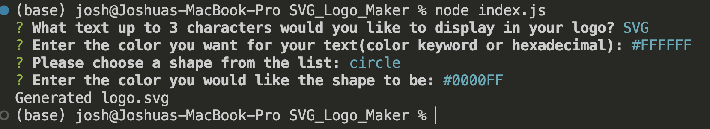

# SVG Logo Maker

 

## Description

This project is a SVG logo maker app that provides a wizard that walks the user through a serious of questions that the answers will be used to generate a simple SVG logo. This project is designed for freelance web developers to allow a quick way to create a simple logo for their projects so that they don't have to pay a graphics designer. So freelance web developers, are you ready to save time and money?! If your answer is yes then the SVG Logo Maker is for you!

## Table of Contents

- [Link](#link)
- [ScreenShot](#screenshot)
- [Installation](#installation)
- [Usage](#usage)
- [Credits](#credits)
- [License](#license)
- [Badges](#badges)
- [API](#api)

## Link
Still need to include the link 
[Sample SVG_Logo_Maker Link]()

## ScreenShot

 

## Installation

In order for this application to run you must have node.js and npm installed on your computer, if you install node.js npm is automatically installed. I provided a clickable link below if you need to install node, the version that the application is using is 16.20.0.  -[NodeJS](https://nodejs.org/en)

## Usage

To use this app first navigate to the SVG_LOGO_MAKER directory that holds the index.js file. Once inside the correct directory write the command "node index.js" and press enter, a wizard will pop up in your terminal with a serious of questions, an example screenshot is below of the code ran and the questioned asked, once you complete the wizard a message at the end will let you know the file has been saved as shown in the screenshot below. NOTE: In the screenshot I used hexadecimal to show an example of how to enter the colors in that format.

## Credits

- Joshua V. Garcia

- [My GitHub Profile](https://github.com/garciajv86)

## License

 
This project is protected under the [MIT](https://choosealicense.com/mit) License.

## Badges

 

## API

The npm inquire package version 8.2.4 is the version package being used. Below is a link, 
once your at the site just click the version and the documentation will pull up.

- [NPM inquirer versions](https://www.npmjs.com/package/inquirer/v/8.2.4?activeTab=versions)
